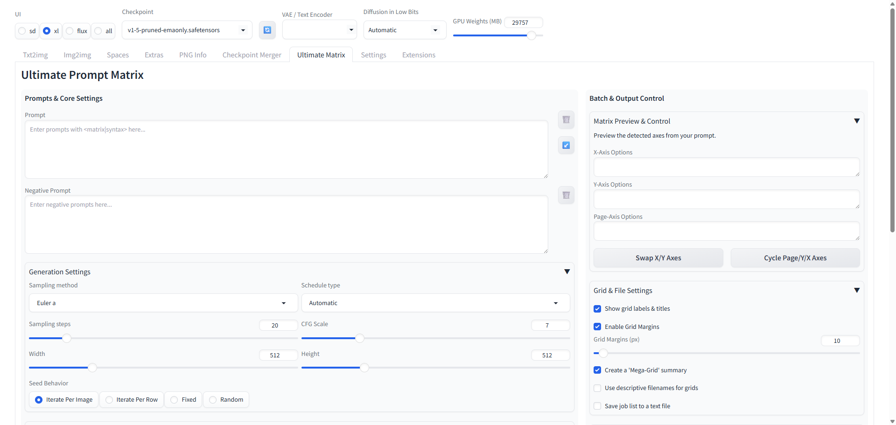

# Ultimate Prompt Matrix Extension for AUTOMATIC1111 & Forge

An advanced prompt matrix extension for AUTOMATIC1111's Web UI and its popular forks. This extension creates its own dedicated tab, providing a powerful and uncluttered interface for generating complex image grids.



## Compatibility
This script is fully compatible with:
- **AUTOMATIC1111's Stable Diffusion Web UI** (recent versions)
- **SD.Next** (formerly Vladmandic's fork)
- **Forge** (the high-performance fork by lllyasviel)
- ...and likely any other fork that maintains the standard extension/script API.

## Features

### Core Functionality
- **Permutation Mode:** Generates all possible substitutions from a prompt (e.g., `a <cat|dog>`). Perfect for comparing variations.
- **Combination Mode:** Generates all possible subsets of optional tags (e.g., `base, <tag1>, <tag2>`). Perfect for testing keyword influence.
- **Always-on Random Syntax:** Use `<random(a|b|c)>` to have one item picked at random from the list for added variety.

### Workflow & UI Enhancements
- **Dedicated UI Tab:** A clean, professional, and spacious interface that will never be cut off or squished.
- **Quality-of-Life Buttons:**
    - `↙️` **Paste Last Prompts:** Instantly populate the prompt fields with the prompts from your last generation job.
    - `🗑️` **Clear Prompts:** Quickly clear the positive or negative prompt boxes with a single click.
    - `🔃` **Refresh Settings:** Instantly see which Sampler, Steps, CFG, Model, etc., are currently active from the main txt2img tab.
- **Dry Run Mode:** Validate your prompt logic and see all generated prompts *before* using GPU time.

### Grid & Output Control
- **Fully Annotated Grids:** Creates grids with clear X, Y, and Page axis labels with large, readable fonts.
- **Toggleable Annotations:** A checkbox to show or hide all text labels and titles on the final grids for a clean, aesthetic look.
- **Mega-Grid Summary:** Optionally combines all page grids into a single high-resolution overview image.
- **File Management:** Options to save a log of all generated prompts and use descriptive filenames for grids.

### Advanced Integration
- **Dynamic Prompts:** Optional integration to process `__wildcard__` syntax if the sd-dynamic-prompts extension is installed.
- **LoRA-Safe Syntax:** The `<...>` parser is designed to ignore `<lora:...>` syntax automatically.


## Installation
Installation is simple via the Web UI's "Install from URL" feature:
1.  In your Web UI, go to the **Extensions** tab.
2.  Click on the **Install from URL** sub-tab.
3.  Paste the following URL into the "URL for extension's git repository" field:
    ```
    https://github.com/LSDJesus/sd-ultimate-prompt-matrix
    ```
4.  Click the **"Install"** button.
5.  Wait for the confirmation message, then go to the **Installed** tab.
6.  Click **"Apply and restart UI"**.

A new tab named **"Ultimate Matrix"** will now appear at the top of your Web UI.

## License
This project is licensed under the **MIT License**.

---
## Acknowledgements

This script was developed with the assistance of Google's AI.