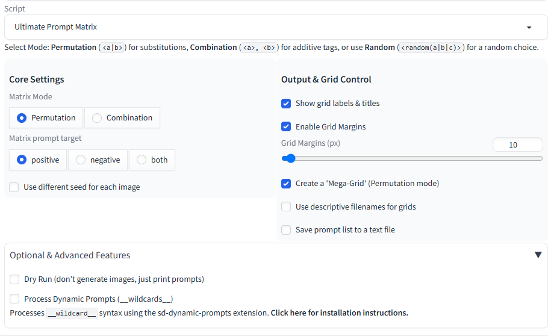

# Ultimate Prompt Matrix

An advanced prompt matrix script for AUTOMATIC1111's Web UI and its popular forks. This script combines two powerful modes for generating prompt variations and is designed for both simple A/B testing and complex, multi-dimensional experiments.

## Compatibility
This script is fully compatible with:
- **AUTOMATIC1111's Stable Diffusion Web UI** (the original)
- **SD.Next** (formerly Vladmandic's fork)
- **Forge** (the high-performance fork by lllyasviel)
- ...and likely any other fork that maintains the standard extension/script API.

## Features
- **Permutation Mode:** Generates all possible substitutions from a prompt (e.g., `a <cat|dog>`). Perfect for comparing variations.
- **Combination Mode:** Generates all possible subsets of optional tags (e.g., `base, <tag1>, <tag2>`). Perfect for testing keyword influence.
- **Fully Annotated Grids:** Creates grids with clear X, Y, and Page axis labels with large, readable fonts.
- **Toggleable Annotations:** A checkbox to show or hide all text labels and titles on the final grids for a clean, aesthetic look.
- **Mega-Grid Summary:** Optionally combines all page grids into a single high-resolution overview image.
- **Dry Run Mode:** Validate your prompt logic and see all generated prompts *before* using GPU time.
- **Save Prompt Log:** Optionally saves a text file of every prompt generated in a batch for your records.
- **Descriptive Filenames:** Optionally save grids with filenames based on their page axis values for easy identification.
- **Advanced Syntax:** Includes always-on `<random(...)>` support and can integrate with the Dynamic Prompts extension.
- **LoRA-Safe Syntax:** The `<...>` parser is designed to ignore `<lora:...>` syntax automatically.

## Installation
1.  On the main page of this GitHub repository, click the green **`< > Code`** button.
2.  In the dropdown, click **"Download ZIP"**.
3.  Unzip the downloaded file. Inside, you will find the `ultimate_prompt_matrix.py` file.
4.  Place the `ultimate_prompt_matrix.py` file into the `scripts` folder inside your Web UI's root directory.
5.  Restart or Reload the Web UI. The "Ultimate Prompt Matrix" will now appear in the Scripts dropdown menu.

## Usage
Select the script from the dropdown, choose your mode and settings, and write your prompt using the `<...>` syntax.

-   **Permutation Example:** `a <fantasy|sci-fi> painting of a <cat|dog>`
-   **Combination Example:** `a beautiful landscape, <masterpiece>, <cinematic lighting>`
-   **Random Example:** `a <random(cat|dog|bird)>`

## Dynamic Prompts Integration (Optional)
This script can optionally process `__wildcard__` syntax if you have the popular **sd-dynamic-prompts** extension installed and enabled in the UI. This integration works across all compatible Web UI forks.

#### How to Install `sd-dynamic-prompts`
If you don't have it, installation is simple:
1.  In your Web UI, go to the **Extensions** tab.
2.  Click on the **Available** sub-tab.
3.  Click the orange **"Load from:"** button.
4.  In the search box, type `Dynamic Prompts`.
5.  Find the extension in the list and click the **"Install"** button next to it.
6.  Once it's installed, go to the **Installed** tab, click **"Apply and restart UI"**.

The "Process Dynamic Prompts" checkbox in this script will now work. For more information on how to use wildcards, please visit the [official sd-dynamic-prompts repository](https://github.com/adieyal/sd-dynamic-prompts).

## License
This project is licensed under the **MIT License**.

---
## Acknowledgements

This script was developed with the assistance of Google's AI.